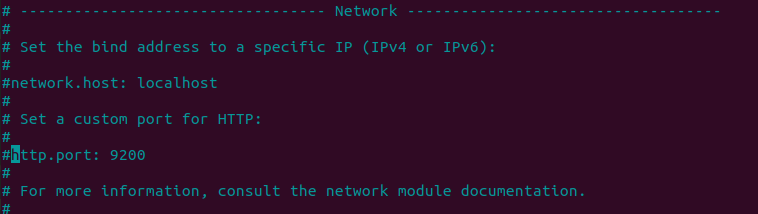

In this post, I will instruct you how to install and configure ELK Stack _(Elasticsearch, Kibana, Logstash)_ on Unbuntu 20.04 _(Focal Fossa)_. You will also know how to create an index in Elasticsearch and write a DSL query for searching on that data. The installation will be done by using command line. OK, so open your terminal then follow the steps.

### Install dependencies

**Java**

To check if you already installed Java Development Kit (JDK), run:
```bash
java --version

```
If the terminal return something like this 


that means you already had JDK installed. Just skip this step and jump into nginx. Otherwise, run the following command to install JDK to your local machine with _JDK v11_

```bash 
sudo apt-get update
sudo apt-get install openjdk-11-jdk

```

or _JDK v8_

```bash
sudo apt-get install openjdk-8-jdk
```

**Nginx**

Basically, you need to install Nginx on your machine as a webserver, for using Kibana dashboard. Copy this simple command and paste it into your terminal. 

```bash
sudo apt install nginx

```

### Install elasticsearch
This process includes 2 main steps: adding the elastic repositories and install the elasticsearch.

**Add Elastic Repository**

As all of packages in ELK stack are signed with the Elasticsearch Signing Key with fingerprint, hence, to enable access to all the software, we need to import the GPG key.

```bash
wget -qO - https://artifacts.elastic.co/GPG-KEY-elasticsearch | sudo apt-key add -

```
By doing this, the system will download and install the key automatically. After excecuting this command, the system should return **OK**.

Next, you need to install the apt-transport-https package before proceeding. 

```bash
sudo apt-get install apt-transport-https

```

The last step in this part is to save the repository definition to _/etc/apt/sources.list.d/elastic-7.x.list_:
```bash
echo "deb https://artifacts.elastic.co/packages/7.x/apt stable main" | sudo tee /etc/apt/sources.list.d/elastic-7.x.list

```

**Install**

First, update the system's repositories since you have added one from the last step of the previous part
```bash
sudo apt-get update

```
Wait till it finish then enter the following command to install Elasticsearch:
```bash
sudo apt-get install elasticsearch

```

### Configure Elasticsearch

Before use, you need to do some changes in config file to make Elasticsearch work. Now, enter the config file with root permission

```bash
sudo nano /etc/elasticsearch/elasticsearch.yml

```
After that, uncomment these lines by deleting the # at the beginning of the line. Let's use the default port (9200) to listen.

_Before_



_After_


Save and quit, using  Ctrl X -> y -> Enter. 

### Enable Elasticsearch

OK, it's time to enable the service and check if it works.

__Enable__

```bash
sudo systemctl start elasticsearch

```

__Send request__

You can check the elastic health, info, indices, etc., by using CURL command.

_Check health_

```bash
curl http://localhost:9200/_cat/health
```


As you can see, the health of cluster is green, so it is healthy. Otherwise, it will return yellow or red.

_Check info_


_Get all indices in the cluster_

|

Top disable the service, run:

```bash
sudo systemctl stop elasticsearch

```


### Install Kibana
Installing this one is way more simple than Elasticsearch. Run:

```bash
sudo apt-get install kibana

```
Once the command is finnished, let's jump right in configuring Kibana. Again, you still need to access the config file with sudo mode.

```bash
sudo nano /etc/kibana/kibana.yml

```
Activate some lines by deleting # at the beginning.
```bash 
#server.port: 5601 ----> server.port: 5601
#server.host: “your-hostname” ----> server.host: “localhost”
#elasticsearch.hosts: [“http://localhost:9200”] ----> elasticsearch.hosts: [“http://localhost:9200”]

```
Finally, save the file then quit.

### Kibana's Using Guide

__Enable/Disable__

You can use the same command in Elasticsearch to enable/disable Kibana

```bash
sudo systemctl start kibana

```
At this point, you should be able to launch kibana dashboard. However, if you enable UFW firewall on your system, you may need to allow traffic on port 5601 (default). Just enter the following command to update the firewall rules.

```bash
sudo ufw allow 5601/tcp

```

__Launching__

Let's see how Kibana welcome us. Open your browser and access to: 

```bash
http://localhost:5601

```

And this is what you get.


**Notes:** Remember to enable Elasticsearch and Kibana service beforehand. 

### Query on Elasticsearch

**Create index**

In this section, we will create a new index on the cluster, add some data and do queries on them.

First, we create the new index by using this command:

```bash
curl -X PUT http://localhost:9200/employees?pretty

```
then it should return:


As we already launched the service via web browser _(at http://localhost:5601)_, we can use the dev tools and get the job done with shorter commands.

```bash
PUT employees

```
you will see the same result returned with the one using command line on terminal. By using this, all the default value has been applied. In case you want to change them, yes, it is possible to do so. **For example:**

```
PUT employees
{
  "settings": {
    "index": {
      "number_of_shards": 3,
      "number_of_replicas": 2 
    }
  }
}
```
The default for *number_of_shards* and *number_of_replicas* are 1. Let's check the indices if our index has been created or not.


**Store some data**

OK. After successfully created an employee index. Now, we need to add some data into it.

Since elasticsearch is schemaless so you don't have to define the fixed schema before adding records just like SQL. However, if you expect a field or prosperty in a specific format, you can use the *_mapping* function to predefine it.

```bash
PUT employees/_mapping
{
  "properties":{
    "date_of_birth":{
      "type": "date",
      "format": "dd/MM/yyyy"
    }
  }
}

```
The system will return with the acknowleged status.

```bash
{
  "acknowledged" : true
}

```
After the mapping, Elasticsearch will expect the input data will have the data_of_birth in format of day(2 digits)/month(2 digits)/year(4 digits). Let's try by adding a document to it. 
```
POST employees/_doc/
{
  "id":1,
  "name":"Huntlee Dargavel",
  "email":"hdargavel0@japanpost.jp",
  "gender":"male",
  "ip_address":"58.11.89.193",
  "date_of_birth":"11/09/1990",
  "company":"Talane",
  "position":"Research Associate",
  "experience":7,
  "country":"China",
  "phrase":"Multi-channelled coherent leverage",
  "salary":180025
}

```

Once it has been added successfully, you will get:

```bash
{
  "_index" : "employees",
  "_type" : "_doc",
  "_id" : "oXc7aXgBVYpS67TH3wrz",
  "_version" : 1,
  "result" : "created",
  "_shards" : {
    "total" : 2,
    "successful" : 1,
    "failed" : 0
  },
  "_seq_no" : 0,
  "_primary_term" : 1
}

```

Above, you can see the __results__ is __created__ and the system also generated the **_id** automatically for this doc. 

**Notes:** the *_id* here is the indexing for the document, it is different from the *id* field of the employee. 

In case you don't want an auto _id, you can set it by adding the _id value at the end, just like:

```
POST employees/_doc/2
{
  "id":2,
  "name":"Othilia Cathel",
  "email":"ocathel1@senate.gov",
  "gender":"female",
  "ip_address":"3.164.153.228",
  "date_of_birth":"22/07/1987",
  "company":"Edgepulse",
  "position":"Structural Engineer",
  "experience":11,
  "country":"China",
  "phrase":"Grass-roots heuristic help-desk",
  "salary":193530
}
```
This command also ends up succesfully with _id is now 2.
```bash
{
  "_index" : "employees",
  "_type" : "_doc",
  "_id" : "2",
  "_version" : 1,
  "result" : "created",
  "_shards" : {
    "total" : 2,
    "successful" : 1,
    "failed" : 0
  },
  "_seq_no" : 1,
  "_primary_term" : 1
}
```
With Elasticsearch, you can add more than one document at a time just by using *bulk* function.

```bash
POST _bulk
{ "index" : { "_index" : "employees", "_id" : "3" } }
{"id":3,"name":"Winston Waren","email":"wwaren2@4shared.com","gender":"male","ip_address":"202.37.210.94","date_of_birth":"10/11/1985","company":"Yozio","position":"Human Resources Manager","experience":12,"country":"China","phrase":"Versatile object-oriented emulation","salary":50616}
{ "index" : { "_index" : "employees", "_id" : "4" } }
{"id" : 4,"name" : "Alan Thomas","email" : "athomas2@example.com","gender" : "male","ip_address" : "200.47.210.95","date_of_birth" : "11/12/1985","company" : "Yamaha","position" : "Resources Manager","experience" : 12,"country" : "China","phrase" : "Emulation of roots heuristic coherent systems","salary" : 300000}
```
And this is what you got responsed. No error and added easily.
```bash
{
  "took" : 7,
  "errors" : false,
  "items" : [
    {
      "index" : {
        "_index" : "employees",
        "_type" : "_doc",
        "_id" : "3",
        "_version" : 1,
        "result" : "created",
        "_shards" : {
          "total" : 2,
          "successful" : 1,
          "failed" : 0
        },
        "_seq_no" : 2,
        "_primary_term" : 1,
        "status" : 201
      }
    },
    {
      "index" : {
        "_index" : "employees",
        "_type" : "_doc",
        "_id" : "4",
        "_version" : 1,
        "result" : "created",
        "_shards" : {
          "total" : 2,
          "successful" : 1,
          "failed" : 0
        },
        "_seq_no" : 3,
        "_primary_term" : 1,
        "status" : 201
      }
    }
  ]
}

```
Back to the pre-defined format, if you keep trying to add a document with wrong format for their date of birth, the system will deny with errors.
```bash
POST employees/_doc/
{
  "id":5,
  "name":"Tumi Nguyen",
  "email":"tumi.bungphe.nguyen@gmail.com",
  "gender":"female",
  "ip_address":"3.169.170.228",
  "date_of_birth":"2014/07/02",
  "company":"Catrang",
  "position":"Meow Meow",
  "experience":4,
  "country":"Vietnam",
  "phrase":"Grass-roots heuristic help-desk",
  "salary":203530
}

```
So you see, I add up here my cat's profile with wrong format: year/month/day. And the system return:
```bash
{
  "error" : {
    "root_cause" : [
      {
        "type" : "mapper_parsing_exception",
        "reason" : "failed to parse field [date_of_birth] of type [date] in document with id 'o3dUaXgBVYpS67THnArq'. Preview of field's value: '2014/07/02'"
      }
    ],
    "type" : "mapper_parsing_exception",
    "reason" : "failed to parse field [date_of_birth] of type [date] in document with id 'o3dUaXgBVYpS67THnArq'. Preview of field's value: '2014/07/02'",
    "caused_by" : {
      "type" : "illegal_argument_exception",
      "reason" : "failed to parse date field [2014/07/02] with format [dd/MM/yyyy]",
      "caused_by" : {
        "type" : "date_time_parse_exception",
        "reason" : "Text '2014/07/02' could not be parsed at index 2"
      }
    }
  },
  "status" : 400
}
```
Changing the date to 02/07/2014 has helped my cat's profile added succesfully in this index. 

**Searching with DSL queries**

Let's do some queries in with these employees.

_Find all employees working for "Catrang" company_

```bash
POST employees/_search
{
  "query": {
    "match": {
      "company": {
        "query" : "Catrang"
      }
    }
  }
}
```
Results:

```bash
{
  "took" : 3,
  "timed_out" : false,
  "_shards" : {
    "total" : 1,
    "successful" : 1,
    "skipped" : 0,
    "failed" : 0
  },
  "hits" : {
    "total" : {
      "value" : 1,
      "relation" : "eq"
    },
    "max_score" : 1.3862942,
    "hits" : [
      {
        "_index" : "employees",
        "_type" : "_doc",
        "_id" : "pHdWaXgBVYpS67THpQry",
        "_score" : 1.3862942,
        "_source" : {
          "id" : 5,
          "name" : "Tumi Nguyen",
          "email" : "tumi.bungphe.nguyen@gmail.com",
          "gender" : "female",
          "ip_address" : "3.169.170.228",
          "date_of_birth" : "02/07/2014",
          "company" : "Catrang",
          "position" : "Meow Meow",
          "experience" : 4,
          "country" : "Vietnam",
          "phrase" : "Grass-roots heuristic help-desk",
          "salary" : 203530
        }
      }
    ]
  }
}
```
The result only contains 1 document _(see hits value)_, which is my cat running her own business. The **match query** in Elasticsearch is case insensitive, so you can use "CATRANG" or "cAtraNG" for the same results. 

_Using AND/OR opertor in matching_

Let try to find some keyword in a field. 

```bash
POST employees/_search
{
  "query": {
    "match": {
      "phrase": {
        "query" : "heuristic roots help"
      }
    }
  }
} 
```
In the above example, Elastisearch use OR operator as default to find all the documents having *"heuristic"* OR *"roots"* OR *"help"* in the *phrase* field. We got 3/5 documents returned with this query.
```bash
{
  "took" : 1,
  "timed_out" : false,
  "_shards" : {
    "total" : 1,
    "successful" : 1,
    "skipped" : 0,
    "failed" : 0
  },
  "hits" : {
    "total" : {
      "value" : 3,
      "relation" : "eq"
    },
    "max_score" : 1.920722,
    "hits" : [
      {
        "_index" : "employees",
        "_type" : "_doc",
        "_id" : "2",
        "_score" : 1.920722,
        "_source" : {
          "id" : 2,
          "name" : "Othilia Cathel",
          "email" : "ocathel1@senate.gov",
          "gender" : "female",
          "ip_address" : "3.164.153.228",
          "date_of_birth" : "22/07/1987",
          "company" : "Edgepulse",
          "position" : "Structural Engineer",
          "experience" : 11,
          "country" : "China",
          "phrase" : "Grass-roots heuristic help-desk",
          "salary" : 193530
        }
      },
      {
        "_index" : "employees",
        "_type" : "_doc",
        "_id" : "pHdWaXgBVYpS67THpQry",
        "_score" : 1.920722,
        "_source" : {
          "id" : 5,
          "name" : "Tumi Nguyen",
          "email" : "tumi.bungphe.nguyen@gmail.com",
          "gender" : "female",
          "ip_address" : "3.169.170.228",
          "date_of_birth" : "02/07/2014",
          "company" : "Catrang",
          "position" : "Meow Meow",
          "experience" : 11,
          "country" : "China",
          "phrase" : "Grass-roots heuristic help-desk",
          "salary" : 203530
        }
      },
      {
        "_index" : "employees",
        "_type" : "_doc",
        "_id" : "4",
        "_score" : 0.977973,
        "_source" : {
          "id" : 4,
          "name" : "Alan Thomas",
          "email" : "athomas2@example.com",
          "gender" : "male",
          "ip_address" : "200.47.210.95",
          "date_of_birth" : "11/12/1985",
          "company" : "Yamaha",
          "position" : "Resources Manager",
          "experience" : 12,
          "country" : "China",
          "phrase" : "Emulation of roots heuristic coherent systems",
          "salary" : 300000
        }
      }
    ]
  }
}
```
If you using the AND operator in the previous matching query, it should return the documents, which contains all 3 words. So, the ones which only contains any of 2 words or just single word are exluded in the result.

```bash
POST employees/_search
{
  "query": {
    "match": {
      "phrase": {
        "query" : "heuristic roots help",
        "operator": "AND"
      }
    }
  }
}
```

Result:
```bash
{
  "took" : 1,
  "timed_out" : false,
  "_shards" : {
    "total" : 1,
    "successful" : 1,
    "skipped" : 0,
    "failed" : 0
  },
  "hits" : {
    "total" : {
      "value" : 2,
      "relation" : "eq"
    },
    "max_score" : 1.920722,
    "hits" : [
      {
        "_index" : "employees",
        "_type" : "_doc",
        "_id" : "2",
        "_score" : 1.920722,
        "_source" : {
          "id" : 2,
          "name" : "Othilia Cathel",
          "email" : "ocathel1@senate.gov",
          "gender" : "female",
          "ip_address" : "3.164.153.228",
          "date_of_birth" : "22/07/1987",
          "company" : "Edgepulse",
          "position" : "Structural Engineer",
          "experience" : 11,
          "country" : "China",
          "phrase" : "Grass-roots heuristic help-desk",
          "salary" : 193530
        }
      },
      {
        "_index" : "employees",
        "_type" : "_doc",
        "_id" : "pHdWaXgBVYpS67THpQry",
        "_score" : 1.920722,
        "_source" : {
          "id" : 5,
          "name" : "Tumi Nguyen",
          "email" : "tumi.bungphe.nguyen@gmail.com",
          "gender" : "female",
          "ip_address" : "3.169.170.228",
          "date_of_birth" : "02/07/2014",
          "company" : "Catrang",
          "position" : "Meow Meow",
          "experience" : 11,
          "country" : "China",
          "phrase" : "Grass-roots heuristic help-desk",
          "salary" : 203530
        }
      }
    ]
  }
}
```

To find exact phrase, you can use *match_phrase* function to return the documents, which contain the exact phrase you are searching for. **For example:**

``` bash
GET employees/_search
{
  "query": {
    "match_phrase": {
      "phrase": {
        "query": "roots heuristic coherent"
      }
    }
  }
}
```
This one will only return the document with _id=4 (Alan Thomas).

_Term query_

Unlike match, term query is case sensitive, so you must be careful while using it.

**For example:** Searching for female employees
```bash 
# correct
GET employees/_search
{
  "query": {
    "term": {
      "gender": "female"
    }
  }
}

# incorrect
GET employees/_search
{
  "query": {
    "term": {
      "gender": "Female"
    }
  }
}     
```

Incorrect result:
```bash
{
  "took" : 0,
  "timed_out" : false,
  "_shards" : {
    "total" : 1,
    "successful" : 1,
    "skipped" : 0,
    "failed" : 0
  },
  "hits" : {
    "total" : {
      "value" : 0,
      "relation" : "eq"
    },
    "max_score" : null,
    "hits" : [ ]
  }
}
```

Correct result:
```bash
{
  "took" : 1,
  "timed_out" : false,
  "_shards" : {
    "total" : 1,
    "successful" : 1,
    "skipped" : 0,
    "failed" : 0
  },
  "hits" : {
    "total" : {
      "value" : 2,
      "relation" : "eq"
    },
    "max_score" : 0.87546873,
    "hits" : [
      {
        "_index" : "employees",
        "_type" : "_doc",
        "_id" : "2",
        "_score" : 0.87546873,
        "_source" : {
          "id" : 2,
          "name" : "Othilia Cathel",
          "email" : "ocathel1@senate.gov",
          "gender" : "female",
          "ip_address" : "3.164.153.228",
          "date_of_birth" : "22/07/1987",
          "company" : "Edgepulse",
          "position" : "Structural Engineer",
          "experience" : 11,
          "country" : "China",
          "phrase" : "Grass-roots heuristic help-desk",
          "salary" : 193530
        }
      },
      {
        "_index" : "employees",
        "_type" : "_doc",
        "_id" : "pHdWaXgBVYpS67THpQry",
        "_score" : 0.87546873,
        "_source" : {
          "id" : 5,
          "name" : "Tumi Nguyen",
          "email" : "tumi.bungphe.nguyen@gmail.com",
          "gender" : "female",
          "ip_address" : "3.169.170.228",
          "date_of_birth" : "02/07/2014",
          "company" : "Catrang",
          "position" : "Meow Meow",
          "experience" : 11,
          "country" : "China",
          "phrase" : "Grass-roots heuristic help-desk",
          "salary" : 203530
        }
      }
    ]
  }
}
```

Finally, you can list all the documents in index by calling:
```bash
GET employees/_search
{
    "query": {
        "match_all": {}
    }
}
```
Or you can just delete it whenever you get bored:
```bash
DELETE employees

```

More practice queries you can find via this [hand-on tuitorial](https://coralogix.com/log-analytics-blog/42-elasticsearch-query-examples-hands-on-tutorial/).

This post only cover Elasticsearch, Kibana problem with some practical DSL queries. You can continue with part 2 of ELK stack series with the installation instruction and using guides for Logstash and Filebeat in [here](https://tuminguyen.github.io/hmnguyen.github.io/blog_detail.html?id=2)

