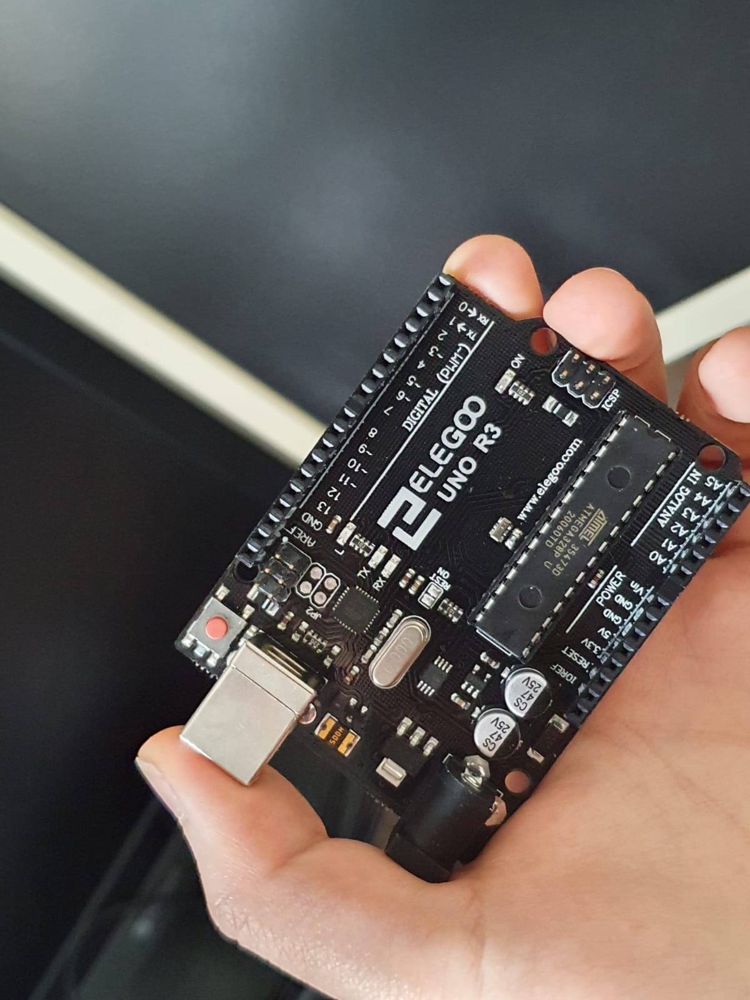
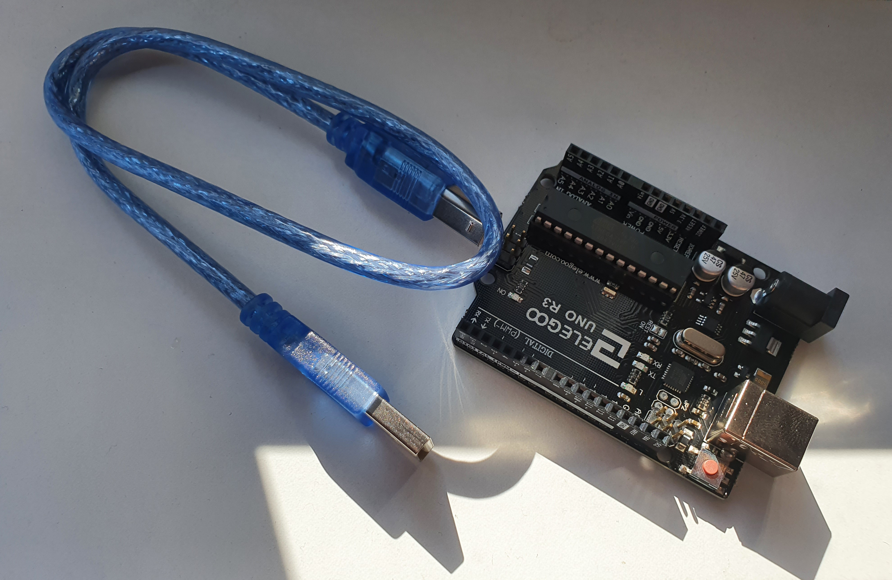
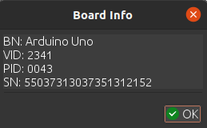
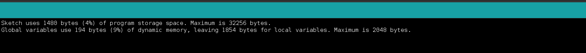
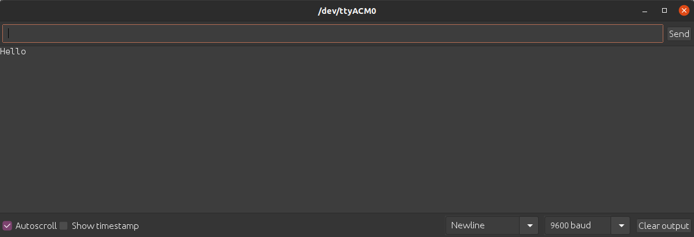

This is my first blog about an IoT device. In which, we will go through all the things you need to know when you want to buy an ELEGOO board. 

```
LET'S FIND OUT if it deverves to be called as the best clone for the original UNO R3 from Arduino? 
```


If you seek the term **Arduino UNO** on the internet or on some e-commerce websites such as Ebay or Amazon, you will get a thousand offers from various manufacturers. One in a bunch of these, of course, you will find Arduino, some can also be listed are AZDelivery, Miuzei, YXPCARS and ELEGOO. My initial plan was just to sastisfy myself, buying one of each company to experience all different clone versions of the UNO board for the first time. Before that, I only heard about Arduino. However, for working purpose only, I decided to take one from [ELEGOO](https://www.amazon.com/ELEGOO-Board-ATmefga328P-ATMEGA16U2-Compliant/dp/B01EWOE0UU/ref=cm_cr_arp_d_product_top?ie=UTF8) to test if that cheap device can really work.


## About ELEGOO company
A little bit about ELEGOO, it is one of the big manufacturers in China, who design and provide 3D printing service. So, basically, you’ll easily find sets of LEDs, resistors, sensors, DC motors, and transistors or any other electronics and programming kit. ELEGOO also offers many good deals with not only for this UNO board, but also with Arduino Nano, Mega, etc.,

## Materials

One word, <span style="color: rgb(196, 14, 127);font-weight:bold;">STUNNING</span>. I can say it is the best and solid board I've ever seen. It may be a little over-reacted but I think the board that I received is even looks better and glossy than the original one. To talk about the experience of holding it on hand, I'd say: solid, thick, stable and high-class materials.



ELEGOO also uses an ATmega328P chip and ATmega16U2 microchip (same as original version) for the board. Attached to the board I ordered, it is an USB 2.0 type A to B cable. You guys can buy only the microcontroller for a cheaper deal.

About the design, each component is also placed exactly the same as the Arduino, except the company name. So, it is basically just like an exact replica of the actual one.



## Functional works

As regards the workable ability, a basic code "HELLO WORLD" was used in this test. Below are all information and figures about the testing environment and results:

**Environment**
```
1. IDE: Arduino IDE
2. OS: Ubuntu 20.04 (Focal Fossa)
```

**Results**

```
1. The IDE instantly recognize board as Arduino UNO R3
2. After select connection port, it was successfully booted and uploaded the code to board without errors.
3. Work perfectly, exactly the same with a genuine Arduino.
```





## Unbeatable prices

With just a half price compared to the original one, works flawlessly, 12 dollars for an UNO board is totally value for money and the price is unbeatable. 

## Top-notch customer service
A bad news on my order was that the item came at first was a defective one, which the bootloader seemed not to work. I then instantly contacted the ELEGOO customer service ([service@elegoo.com](service@elegoo.com)) to report the fault. From the responses, I was quite sastified and happy with the way they took responsibility. They really tried to figure out the problem and proposed for a solution, not finding an excuse. Finally, we ended up with another replacement sending from ELEGOO again without me having to return the defective one back. The shipment on the other hand took seriouly long, about 20-30 days and it was irritated me at many times. However, when I received the new one, again, with a charming appearance and this time it worked, I was so pleased.

Some time I see that we buy a product not only because of the quality but also the good attitude of the merchant. I have to admit that I was so pissed off about being the unlucky one over a thousand and million people out there getting a broken board. Trying new thing is always risky and the possibility to receive a flawed device is always exist, even with a big company. 

**So, for ELEGOO, come back? 100%.**
