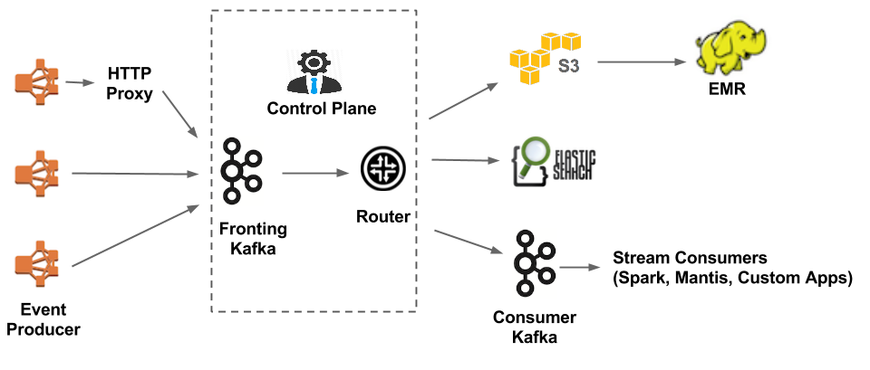

In blog post, we will find out  and explain concisely how Netflix utilize Elasticsearch in their system by answering 3 main questions: Who? How? and Why?. So let's get started.

### Who is Netflix?
Basically, Netflix is an American company that founded in 1997. They provide streaming service with a wide variety of TV programmes, films, documentaries and more. They stream it **globally** on **thousands of internet-connected devices**.    

As you can see from the image above, Netflix system is having a really bulky architecture with lots of phases. Each phase produces tons of log everyday and make it more common to be known as a **logging company**. 

Some statistical figures to check out:
- **600+ billions** events ingested per day
- **8-11 millions** events during peak hours ~ approx. **24 Gb/s**
- **1.3+ Petabyte** per day 

### How will they use Elasticsearch in their system?

**Hundreds** types of event going through the Keystone processing pipeline can be listed: video viewing activities, UI activities, error logs, performance events, troubleshooting & diagnostic events, etc., So the challenge is now how to make sense of billion of events per day as Netflix stores lot of logs. 

Along the evolution of data pipeline, Netflix collects the data, write them to S3 for all offline processing in the very first version. However, as the growing needs, we want to put them go online and do it realtime. Therefore, a solution for big data has been introduced with more efficient and much simpler approach. All the traffic go into Kafka *(producer)* before being routed to Elasticsearch or S3 and comsumed by Kafka consumer. We are then freely to use many real-time stream processing tools such as Spark or Mantis once the data is at Kafka consumer. By eliminating the Chukwa and substituting with Kafka, we has improved the durability of the pipeline since Kafka implements replication while Chukwa doesn’t. 

As regards the mentioned 1.3 Pb of data per day, Netflix uses 1500 clusters of Elasticsearch and 3500 instances alone to hold and do analytic, visualize on that enormous amount of data. Elasticsearch operates in a distributed environment: with cross-cluster replication, a secondary cluster can spring into action as a backup. 

The main use of Elasticsearch is for log-search. For example:
- Tracing detailed errors if any happended, that helps in customer support and debugging
- Monitoring resource usage
- Tracking mail campaigns: which has been sent to customers and which not
- Plot the trend from user interactive actions: find out the most popular or concerned films, most search keywords, etc.,

### Why Netflix need Elasticsearch?
But why Elasticsearch, but not anything else?

As in the fast evolving system, Netflix want to be able to add a new field, a new document at anytime for example a new description for an old film. So, they should go **schemaless**. At the same time, we still can set a default for some specific fields if we want.

In fact, there is lots of metatdata of a document, maybe up to hundred or thoudsand of fields. However, for normal searching purpose, we usually don't need all of them but only a few. We can also acquire the documents in any combinations of fields we are interested in with _"fields"_ query. The use of _"fields"_ query allows us to retrieve what we really want to search for.

With Elasticsearch, Netflix can also do sharding and replicate on their documents, protect the data against hardware failure and increase capacity to serve read requests like searching or retrieving a document more faster. Nevertheless, due to the heavy traffic, they only set 2 replicas and 4 as the perfect number of sharding for each doc. The number of sharding can be changed up to situation and use case.

Elasticsearch offers many plugins, one of them is Kibana - a powerful tool to draw a lively dashboash for your monitoring purpose. It also has an active community to support when we got bugs while using it.

To sum it up, Elasticsearch bring us:
- schemaless: may change at anytime
- flexible default: setting default format or type for fields
- compatible with JSON: it works with JSON request and return JSON data
- easy searching: may search for any combinations of fields
- automatic sharding and replication: easily scale out instances and clusters
- nice extension models: easily work on cloud with multiple customisation
- nice ecosystem: big support community

Hope this blog post give you a concise enough answer for the use of Elasticsearch in industry companies, hereby, Netflix. For getting more detail, please check out one of the references below.

### References
https://netflixtechblog.com/evolution-of-the-netflix-data-pipeline-da246ca36905

https://www.elastic.co/videos/netflix-using-elasticsearch

https://medium.com/@narengowda/netflix-system-design-dbec30fede8d