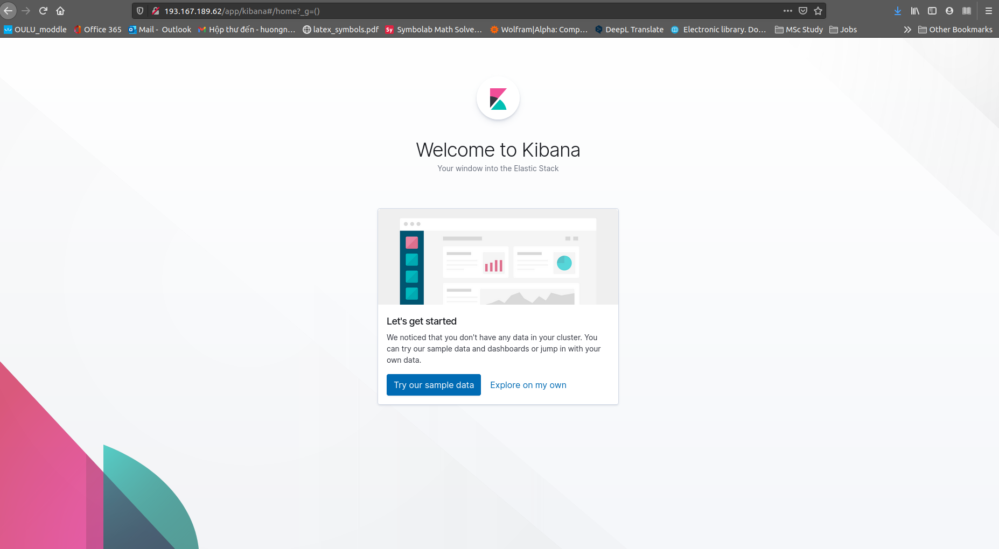

<span style="font-weight:bold; font-size: 30px">Wait ?!?</span> <span style="font-weight:bold; font-size: 30px">WhoooooT ?!!!</span>

I installed it once. Is that something wrong with the last guideline?  

<span style="color: rgb(196, 14, 127);font-weight:bold; text-transform: uppercase">Just calm yourself down and make it simple!</span>

The Elasticsearch and Kibana you installed on your local machine from the [previous blog](https://tuminguyen.github.io/hmnguyen.github.io/blog_detail.html?id=1) is totally fine. Let's think about it as an one-node cluster of elasticsearch, where you can use the resource to process all the tasks. Hereby, that cluster is your physical computer. So, basically, you can say **1 computer is equivalent  to 1 node**. Then, what if we need a bigger cluster with more nodes to run a bigger task for a bigger project? 

Yes, you will need more than 1 computer or 1 operation system (OS) to stand for each node. Again, how can you afford for 4 physical computers at once? That's why we need to use the virtual ones. So in this blog, I will help you in setting things up to be ready for your heavy work.

# About CSC
CSC is an IT Center for Science, which is owned by Finnish Government and higher education institutions. They provide cloud services for education and teaching in free of charge that you can use to deploy self-administered infrastructure using a simple user interface. Here, we just mention CSC with a short introduction for a nice service they offer. However, in case you are interested on what they do and want to find out more, just click on the link in the _references_.


# Warming up
### Enable cPouta

First, open your browser then access to [my.csc.fi](https://my.csc.fi/welcome). Click the login button on the top-right corner and the system will redirect you to authenication page.


For those who already has the CSC account, just click on that option to finish your log in process. However, in here, I will choose the Haka login, which is linked to my university's account for the authentication. The welcome screen after a successful login should looks something like:


OK, so from this, click on **My projects** on the left menu tab to see all the projects you have. Select the one you work with or just create a new project. 

In the project management screen, take a glance at the **Services** column on the right. You will see there are many services with different power and purpose to use, however, they are all disable. Anyway, you only need cPouta to be enabled here, so just toggle down the Cpouta tab, accept with the conditions and that's it. 


After enabling the cPouta service, you can see the mark now has changed to a <span style="color: #82bf37; font-weight:bold">green tick</span>. Once you reach that, you are ready to use Pouta. 

To see why we choose cPouta instead of others, especially ePouta. What is the differences between these types? Please check out for more detail at [cPouta](https://research.csc.fi/-/cpouta?pk_vid=3e40284cf35a7a4316170621743a9b56) and [ePouta](https://research.csc.fi/-/epouta?pk_vid=3e40284cf35a7a4316170621763a9b56).

### Pouta dashboard setup

The next step in this warming up section is to login the [Pouta dashboard](https://pouta.csc.fi/) to create the cluster nodes. As followed by this blog, you will create a 4-nodes cluster for your Elasticsearch system: 
+ 1 master node
+ 2 data node
+ 1 ingest node _(running Kibana)_.

After access your dashboard via Haka login, you will now create the key pair, which is used to connect with the nodes from your local computer via SSH. By connecting to the instance/server/node, you can execute all your commands on the data afterwards.

**Note:** Remember to choose the right project you are working with on the top left of the screen.


<ins>Create new key pair<ins>

To create a new keypair, click on the **Key Pairs** subtab on the left menu, under the **Compute** tab. Click on **Create Key Pair** then set whatever the key name you want.


Once you successfully create that, the new key pair will display on the table and a pop-up download dialog will also appear to save the file. 


<ins>*Set up security groups*<ins>

One important thing to make sure that you can connect to cluster nodes is to open the traffic over the communication ports. Just do the following steps:
- In the same left menu, click on the **Security Groups**, which is a subtab under the **Network** section. 
- Click on the **Manage Rules** button on the right of the 1st row
- Click on **Add Rule** to open the traffic over:
    + port 22 (SSH): access to the nodes, control by command line
    + port 80 (HTTP): access kibana dashboard from our local computer


The CIDR contains the IP adress that is allowed to use the port. Hereby, I prefer to keep the default value as 0.0.0.0, so every IP adress can access via the added port. On the other hand, you can set it only as your IP, which you can get by using:
```bash
curl ifconfig.me
```
Just paste what the system return to the CIDR field then finish it.

<ins>*Create the nodes*<ins>

Now go back to **Compute** tab then click on **Instances** to start to create 4 different nodes in our cluster.


Click on the **Launch Instance** and you will see a pop-up setting dialog. Just set the value followed by this below image.

In the detail tab:


```
Availability Zone: nova
Instance Name: node                     # the nodes will be named after like node-1 node-2 node-3 node-4
Flavor: standard.3xlarge                # the size of launching image
Number of Instances: 4                  # number of nodes
Instance Boot Source: Boot from image   # Choose to boot from  OS image file (For eg: .iso)
Image Name: Ubuntu-20.04                # Choose the OS and OS version you want to boot for your virtual machine
```

In the Acceess and Security tab:


Click **Launch** then wait.


You can see the nodes has been built and spawned. It will take you some time to finish, but not too long. 

Please note that the IP address with 192.168.1.x on the screen is just a local IP that used to communicate between instances. However, to access the nodes from our local machine, you need to create a public IP for each. To do that, just follow:
1. Click on the dropdown button under **Actions** column then choose **Associate Floating IP**


2. Now, a dialog should appear

    

    At the moment, no floating IP was created so we need to add a new one by clicking on the plus icon **+**

3.   Another pop-up will be shown and you just need to click on **Allocate IP**  button to allocate the public IP for the particular node.


4. Click **Associate**


Then FINISHED. Do that for all the 4 nodes until end up with something like this:


# Make your hands dirty

Now, let's do the main work: _configuration_.

### Change folder of .pem file 

First, go to the folder containing the .pem file that you've already downloaded before then copy it to the .ssh/ folder using the move command. 

The reason for moving this key file into the .ssh folder is because it is the key that you use make the SSH connection from your local computer to different virtual machines. You only need to set up it once, inside the .ssh folder for easier access to the nodes in future.

Since I set the default download folder to **Download/** and the **.ssh/** is already existed in my Ubuntu 20.04 after some SSH connection I have made before. However, for those who does not have the .ssh/ folder, just create one 
``` 
mkdir  ~/.ssh    

# or just
# mkdir .ssh 
# when you already at home folder.
```
Next, you need to move the file with the following syntax: 

``` 
mv old_position new_position
```
_Example:_
``` 
mv Downloads/myPoutaKey.pem .ssh/

```
Execute the command and check if it is already moved to the new folder by typing:
```
ls -l .ssh/         # or use ll for short (example: ll .ssh/)
```
You should see something like this:
```
-rw-rw-r-- 1 tumi tumi 1675 Thg 3  30 00:20 myPoutaKey.pem
``` 
In case you have many files in your .ssh/ folder and it is hard to find the .pem file. Use:
```
ls -l .ssh/ |grep yourfilename 
```
Example:
```
ls -l .ssh/ |grep myPouta
```
The system will highlight the keyword that you are looking for.


### Change the file mode

After being sure about the existence of the file under .ssh folder, we need to change the mode of it into 700 to make it readable, writeable and executable but for only the current user, not for all. 

```
cd .ssh/                    # go to .ssh directory
chmod 700 myPoutaKey.pem    # add more privilege to current user to execute on file
```
You can see the file is executable now.

```
-rwx------  1 tumi tumi 1675 Thg 3  30 00:20 myPoutaKey.pem*
```

Before using the key pair to connect with the nodes, you need to protect by using ssh-keygen and change it to read-only mod.

```
ssh-keygen -p -f myPoutaKey.pem         # generate a passphrase to protect the file
chmod 400 myPoutaKey.pem                # make the file as read-only
```

**Don't try to use the complex passphrase for the key, you might need to type it for several time after.**

Once you see 
```
Your identification has been saved with the new passphrase. # after run ssh-keygen
```
and 
```
-r-------- 1 tumi tumi 1856 Thg 3  31 17:49 myPoutaKey.pem # after run chmod
```
you can be sure that everything is in order.

**Notes:** The step of changing mod for the file is very important to make thing works so please remember to make it done before creating a protecting password for the .pem file. 

In case you are trying to generate a secure key without changing the mod first, you will get permission warning like this:


### Connect to nodes

It's time to jump right in the most interesting stage in configuration. Open your terminal and ready to access the servers. The process is pretty similar for each node. However, it still has some different steps so please read the instruction carefully.

<ins>_Open terminal_<ins> 

You can choose do the configuration one by one or do it for all nodes at the same time using:
- Shortcut to open your first terminal: **Ctrl + Alt + T** 
- For the next one, just use **Ctrl + Shift + T**.

By doing this, we will have 4 sub-terminals vertically split the main one in equal. This will help us to easily differentiate which tab is for which node afterwards and also be useful in fast switching by **Alt + tab_number**.


In case you find the font is too small to read, just zoom it in bby **Ctrl + Shift + +**, otherwise, use **Ctrl + -** to zoom out.

<ins>_Access via SSH_<ins>

From home foler, type the following command to access the node with its public IP (floating IP)

```
ssh ubuntu@floating-ip -i pem-file
```

Example:
```
ssh ubuntu@195.148.31.44 -i .ssh/myPoutaKey.pem
```
The system will ask you about the continue connecting and the passphrase you set for the .pem file. 

Type **yes** for the first question.

After a successful access, you will see the user and the instance name at the beginning of the command line.
```
ubuntu@node-1:~$
```
Repeat the steps for the rest 3 nodes and now in the terminal's tab bar, you can easily find which server is the one you are work with.


### Install Elastic and Kibana to nodes
As we already defined the task for each node. We will set:
- node 1 = master node
- node 2 = data node
- node 3 = data node
- node 4 = ingest node + Kibana

From that, every node in the cluster needs to be installed Elasticsearch. Besides, the fourth one also needs Kibana to run the dashboard. In this post, we will install Elasticsearch 7.0.1. 

<ins>*STEP 1: Install Elasticsearch*<ins>

To install the particular version of Elasticsearch, instead using the ```sudo apt-get install``` command in [the previous blog](https://tuminguyen.github.io/hmnguyen.github.io/blog_detail.html?id=1), that will download the latest version of Elasticsearch, you must specify the one you want to install.

```
# 1: download Elastic debian packgage version 7.0.1
wget https://artifacts.elastic.co/downloads/elasticsearch/elasticsearch-7.0.1-amd64.deb

# 2: install the package 
sudo dpkg -i elasticsearch-7.0.1-amd64.deb

# 3: update the system after a new installation
sudo apt update
```

**Notes:** Before that, you also need to install Nginx **(on node-4)** and JDK **on all nodes** for later use of Kibana. Follow [this](https://tuminguyen.github.io/hmnguyen.github.io/blog_detail.html?id=1) to install.


<ins>*STEP 2: Configure yaml file*<ins>

At this step, it is more complex to configure the ```elasticsearch.yml``` file compared to the [previous tutorial](https://tuminguyen.github.io/hmnguyen.github.io/blog_detail.html?id=1). So if we only work on 1-node cluster of Elasticsearch, we don't need to do much on the configuration. However, as we have more than 1, we will need to assign the role for each node then define its communication.

If you still remember about the local network of each node _(192.168.1.x)_, now, you can retrive it to later use of binding the the hostname _(node-x)_ by using. 
``` 
hostname -I
```
Run this command then save what the system return. Something like this:
```
192.168.1.10
```

In Ubuntu, the elastic config file is located at ```/etc/elasticsearch/```. Now, use ```sudo nano``` command to access.

``` 
sudo nano /etc/elasticsearch/elasticsearch.yml
```
From the orginal file


you will need to enable some lines and edit it with more information to complete the configuration. In particular, you need to focus on **Cluster**, **Node** **Network** and **Discovery** sections of the file.

```
---------------------------------- Cluster -----------------------------------
# delete the # sign at the beginning of the lines
# set any name you want for the cluster, but make sure they are all the same in 4 nodes

#cluster.name: my-application  -> cluster.name: my-application 

------------------------------------ Node ------------------------------------
# delete the # sign at the beginning of the lines
# set name for the specific node (recommend: hostname)

#node.name: node-1 -> node.name: node-1

# assign the role for the node (for node 1,2,3)
node.data: true
node.master: true
node.ingest: false 

# assign the role for the node (for node 4)
node.data: false
node.master: false
node.ingest: true

---------------------------------- Network -----------------------------------
# delete the # sign at the beginning of the lines
# edit the network.host to the local IP of the node (recommend: hostname -I)

#network.host: 192.168.0.1 -> network.host: 192.168.1.10
#http.port: 9200 -> http.port:9200

--------------------------------- Discovery ----------------------------------
# delete the # sign at the beginning of the lines
# add list of local IP in the format ["..", "..", "..", ".."]

#discovery.seed_hosts: ["host1", "host2"] -> discovery.seed_hosts: ["192.168.1.10", "192.168.1.18", "192.168.1.15", "192.168.1.7"]
#cluster.initial_master_nodes: ["node-1", "node-2"] -> cluster.initial_master_nodes: ["192.168.1.10", "192.168.1.18", "192.168.1.15", "192.168.1.7"]
```

It should end up something like this


Save and quit the file by: ```Ctrl+x``` then ```y``` then ```Enter```.

Now, the Elasticsearch would work. We will enable and start the service using:
```
sudo systemctl enable elasticsearch # auto start the service on boot
sudo systemctl start elasticsearch  # start the service instantly
```
Check if it can work perfectly then install Kibana for node 4, the one we set as the ingest instance. We also use the version 7.0.1 in this blog.

<ins>*STEP 3: Install Kibana*<ins>

```
# 1: download Kibana debian package version 7.0.1
wget https://artifacts.elastic.co/downloads/kibana/kibana-7.0.1-amd64.deb

# 2: install the package
sudo dpkg -i kibana-7.0.1-amd64.deb

# 3: update the system after a new installation
sudo apt update
```

Again, we need to config the yaml file of Kibana, which is located in ```/etc/kibana/kibana.yml```

```
# uncomment the line by deleting # sign at the beginning
#server.port: 5601 -> server.port: 5601

# change the host by the local IP address of the node (hostname -I) 
#elasticsearch.hosts: ["http://localhost:9200"] -> elasticsearch.hosts: ["http://192.168.1.7:9200"] 

```
Save and quit the file then enable and start the Kibana service.

```
sudo systemctl enable kibana
sudo systemctl start kibana
```

<ins>*STEP 4: Config Nginx*<ins>

After installing Nginx, we still need to do an important configuration.

As the reason that Kibana runs on localhost, we need to create a virtual host file in ```/etc/nginx/sites-available/``` to allow the external access. 

First, open the new file
```
sudo nano /etc/nginx/sites-available/myApp  # use any name file you want, I set it "myApp" here
```
Second, add some information about the server (node-4)
```
server {
    listen 80;
    server_name 193.167.189.62;      # The public/floating IP address of node-4 
    auth_basic "Restricted Access";
    auth_basic_user_file /etc/nginx/htpasswd.users;
    location / {
        proxy_pass http://localhost:5601;
        proxy_http_version 1.1;
        proxy_set_header Upgrade $http_upgrade;
        proxy_set_header Connection 'upgrade';
        proxy_set_header Host $host;
        proxy_cache_bypass $http_upgrade;
    }
}
```
Save and quit the file.

Now, if you want to create user and password for kibana login, please do as follow. Otherwise, just skip.
```
# Create user and password, store the data in htpasswd.users file
echo "kibanaadmin:`openssl passwd -apr1`" | sudo tee -a /etc/nginx/htpasswd.users

# As kibanaadmin is the default username, you can freely change it to whatever you want. 
# Example:
echo "admin:`openssl passwd -apr1`" | sudo tee -a /etc/nginx/htpasswd.users

```

After you run the command, you are required to give the password for the ```admin```. Again, just make the password secure enough, not too complex. 

Alright, let's test if we have configured Nginx successfully or not.

```
# Creating a symbolic link to the sites-enabled directory. It is just for making another access point to the file.
# More info can be found at https://www.nixtutor.com/freebsd/understanding-symbolic-links/
sudo ln -s /etc/nginx/sites-available/myApp /etc/nginx/sites-enabled/myApp

# Check for wrong syntax in Nginx config file
sudo nginx -t

# Enable service
sudo systemctl enable nginx

# Start service
sudo systemctl start nginx
```
If we check the status of working, we will see Nginx is running fine.


Now, restart Kibana and access the UI with the public IP of node 4.
- Restart Kibana service
    ```
    sudo systemctl restart kibana
    ```
- Open browser and aceess the Kibana UI by typing the IP: [193.167.189.62](193.167.189.62). A pop-up login dialog should appear
    
- Fill in the user and password and sign in.


Everything works perfectly. 

In case there is any errors happen to Kibana web access, just check again:
- All the configuration files of Elasticsearch, Kibana and Nginx.
- The connection between nodes: be sure that one node can discover the others. Use ```curl node-x:9200/_cat/nodes``` command and the expected result should be:

```
192.168.1.10 33 7 0 0.01 0.02 0.00 md - node-1
192.168.1.7  14 9 2 0.06 0.11 0.15 i  - node-4
192.168.1.15 16 7 1 0.06 0.11 0.05 md - node-3
192.168.1.18 23 7 1 0.12 0.08 0.02 md * node-2
```
You can also use ```curl node-x:9200``` to test the connection on **every** node _(x can be 1 or 2 or 3 or 4)_. If it all returns something like this:

```
{
  "name" : "node-1",
  "cluster_name" : "my-application",
  "cluster_uuid" : "VHshuxgqT7mjP3XWd2d0Qw",
  "version" : {
    "number" : "7.0.1",
    "build_flavor" : "default",
    "build_type" : "deb",
    "build_hash" : "e4efcb5",
    "build_date" : "2019-04-29T12:56:03.145736Z",
    "build_snapshot" : false,
    "lucene_version" : "8.0.0",
    "minimum_wire_compatibility_version" : "6.7.0",
    "minimum_index_compatibility_version" : "6.0.0-beta1"
  },
  "tagline" : "You Know, for Search"
}
```

Then it should be fine.

Let's finish this blog here and ready to crawl some data in the [next post]().


## References
- [About CSC](https://www.csc.fi/en/home) 
- [About Pouta](https://www.csc.fi/en/web/education/pilvipalvelut)