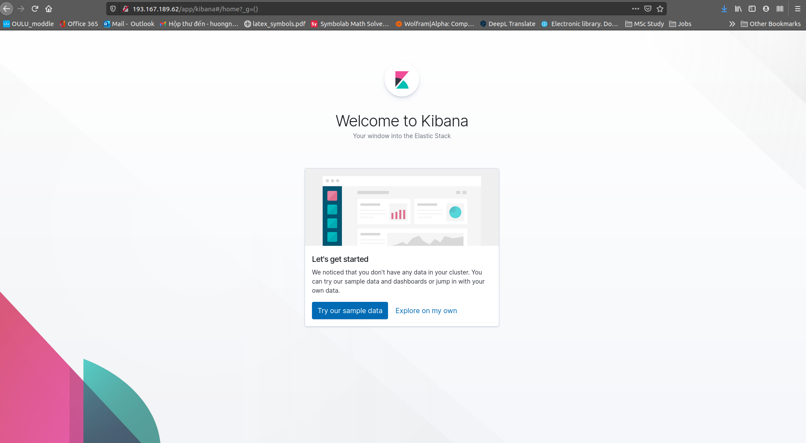
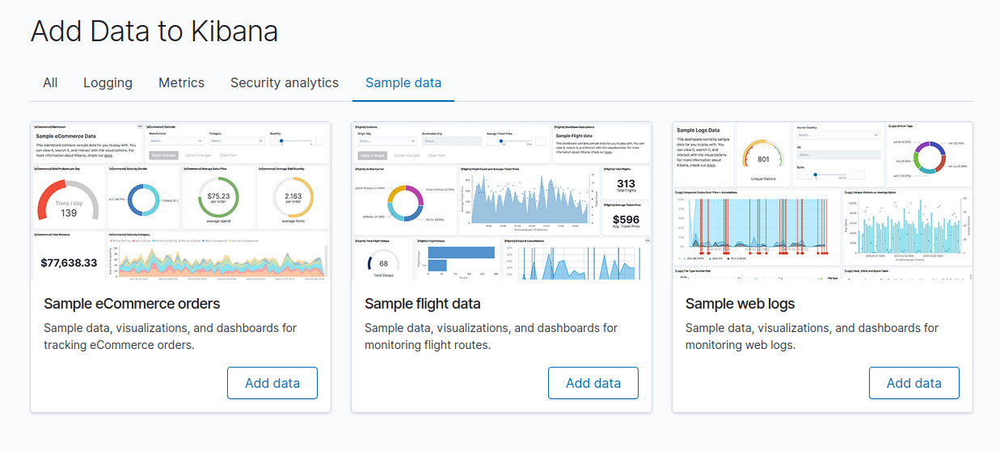
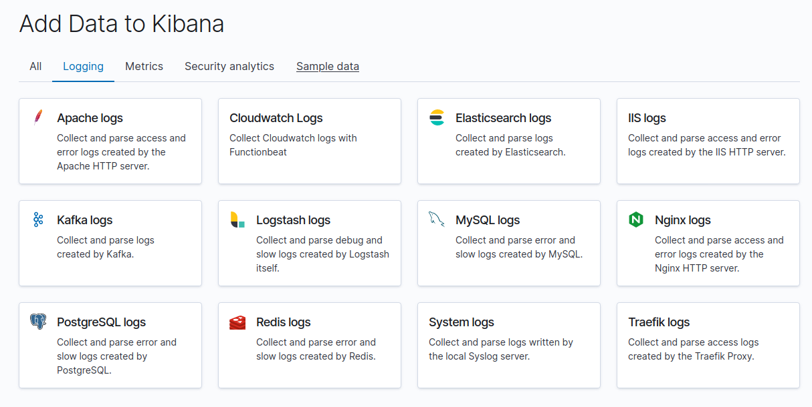
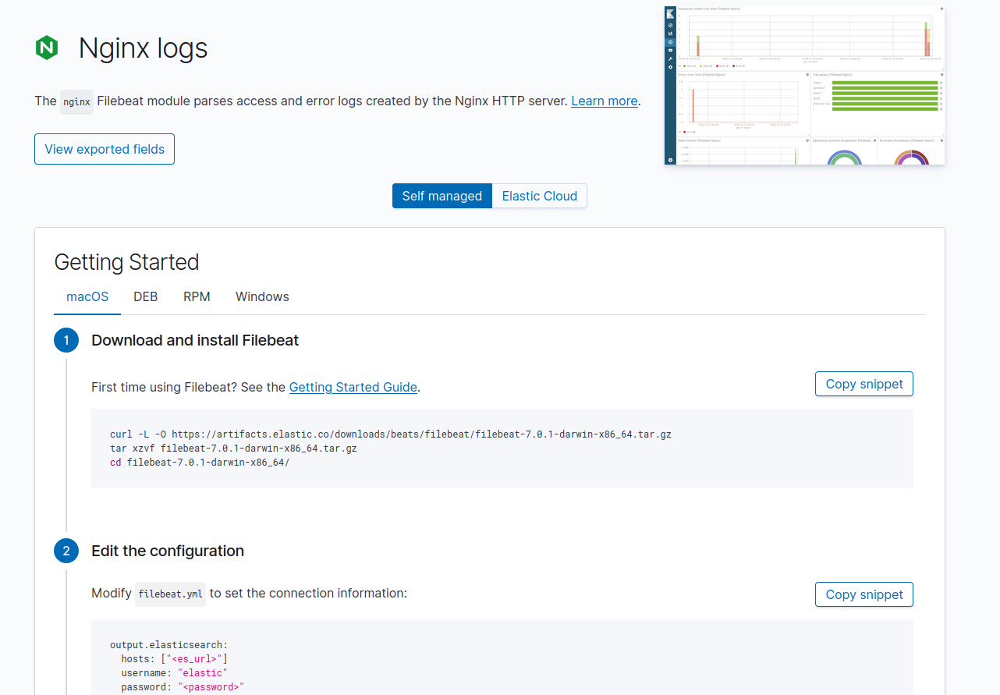
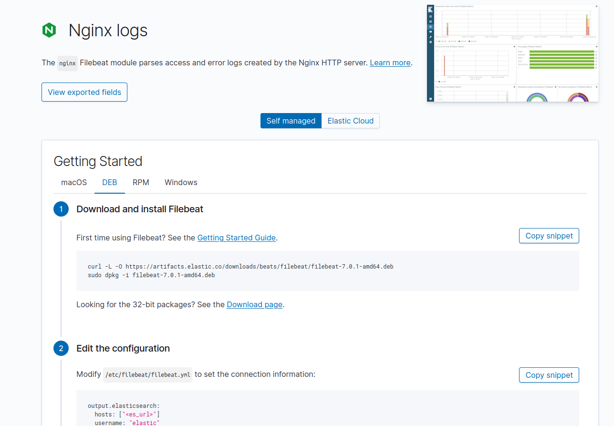
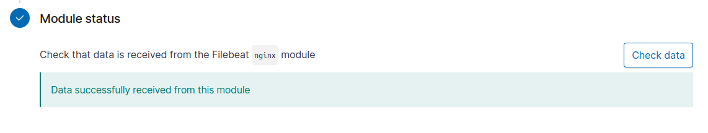
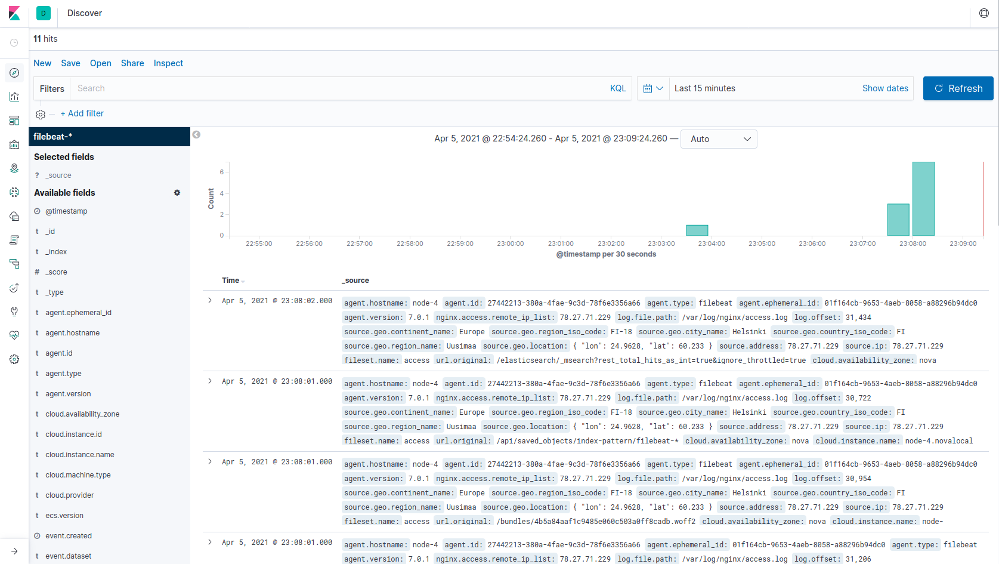

Have you just came here from [this blog](https://tuminguyen.github.io/hmnguyen.github.io/blog_detail.html?id=5)? If yes, then welcome to the next step in the exploring ELK stack series. In case this is the first time you are here, I would recommend you to go back and read the [prior blog](https://tuminguyen.github.io/hmnguyen.github.io/blog_detail.html?id=5) to get the basis first.

In this week tutorial, we will try to scrap some logs and visualize it real time on Kibana. Sounds COOL, right? :satisfied:

**LET'S GET STARTED.**

If you are still remember about Logstash and Filebeat, which are discussed in [this post](https://tuminguyen.github.io/hmnguyen.github.io/blog_detail.html?id=2), you will see it clearly on how power the Logstash is and many advantages that come from Filebeat. 

According to that, hereby, we will try to crawl the Nginx logs with Filebeat, store it in our Elasticsearch cluster and visualize it lively in Kibana.

All the process will be executed on node-4, the one that ingest the events and not participating as data or master node. This post will be so easy to follow and implement. 

# Set up

First open your terminal and ssh to the 4th node.
```
ssh ubuntu@193.167.189.62 -i .ssh/myPoutaKey.pem    # change 193.167.189.62 with the public IP of node 4 in your cluster
```

Once sucessfully login, you need to install Filebeat to start crawling logs.

You can totally install it in the way that I have introduced in [this blog](https://tuminguyen.github.io/hmnguyen.github.io/blog_detail.html?id=2). However, I <span style="color: rgb(204, 45, 71); font-weight:bold">highly recommend</span> you to follow the steps in here because it is more straight forward and fit to our process on multiple nodes cluster.

At the end of the previous post, we are already access the Kibana Interface on browser via the public IP. It should be something like this.



Now, click on **Try our sample data** to play around with Kibana using some existed samples. 



Switch to **Logging** tab to discover many type of logs that Kibana already integrated.



Click on **Nginx logs** and it will redirect you to a [detail setup page](http://193.167.189.62/app/kibana#/home/tutorial/nginxLogs?_g=()), which looks something like:



Freely choose the OS you are using, in here, I switch the instruction for the Debian tab **(DEB)**.



From here, you just need to go ahead, copy the commands manually and paste them on your terminal. Or, you can also copy the instruction commands by clicking the **Copy snipnet** button over each script. After following all along, you will easily install the Filebeat, configure it correctly and scrap the log without any errors.

In case you are struggling with *configuring the yaml file* by the original instruction _(step 2)_, here is some illustration to make it more clear.

1. Open the config file
    ```
    sudo nano /etc/filebeat/filebeat.yml
    ```
2. Make some change in these following lines
    ```
    # scroll down and find Kibana section

    #==============================Kibana=====================================
    ...
    setup.kibana:
        ....
        #host: "localhost:5601"     # uncomment this line and change localhost with your hostname -I value

    # scroll and find Elasticsearch output section
    #-------------------------- Elasticsearch output ------------------------------
    output.elasticsearch:
        # Array of hosts to connect to.
        hosts: ["localhost:9200"]       # change localhost to your hostname -I value

    # For username and password configure, you can pass or set it for yourself. In here, I pass.
    ```

    Save and quit the file, using ```Ctrl + x``` then ```y``` then ```Enter```.
    
The setup in step 4 will take you some times (~ 1-2 mins) to finish. 

Enable the service and check for data recieved by clicking the **Check data** button on the final step.



If you see something like the above image, let's celebrate cuz everything until now is in its order.

# See the log

To see the real-time log, just click on **Discover** icon, which is the first one on the left menu. You can refresh the page to see the new events that Nginx module has imported to Elasticsearch and save it under the **filebeat** index _(filebeat is the name of the index)_.

You can check for the available indices in Elasticsearch by typing:
```
curl node-4:9200/_cat/indices
```
the system will then return:

```
green open filebeat-7.0.1-2021.04.05-000001 Dt6LUWG4SlOz9NG5r5_RgA 1 1 516  0 804.4kb 429.3kb
green open .kibana_1                        8aTthMvLT3WsvvaENsXPcA 1 1 613 35 819.4kb 419.1kb

```



The events here are not 100% real-time but they still have a small delay like 1 minute before displaying for you on Kibana.


# Customize your dashboard

To manage your own dashboard, click on **Dashboard** icon on the left menu _(the 3rd one)_. 

In here, you can create a new one or reference one of the old templates then customize it to your style. You can also search for the specific keyword like the log you are trying to visualize.

