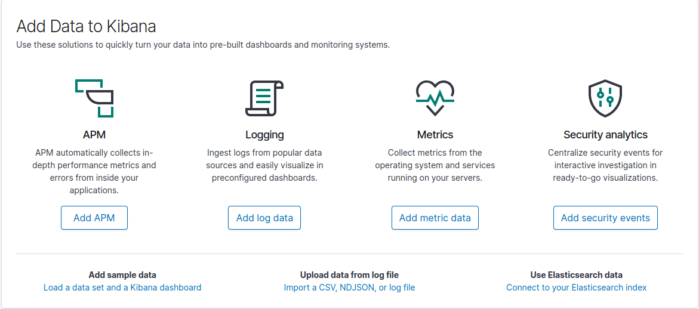
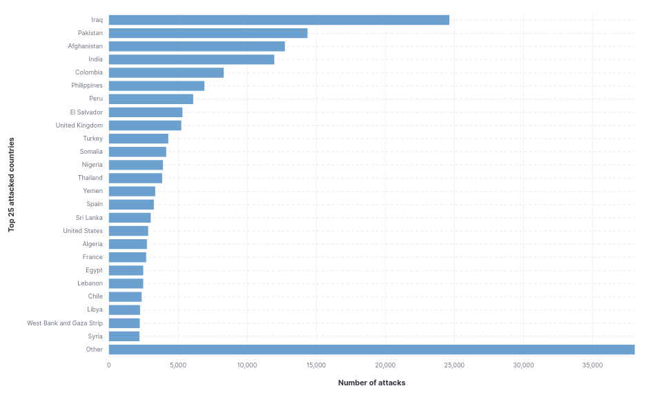
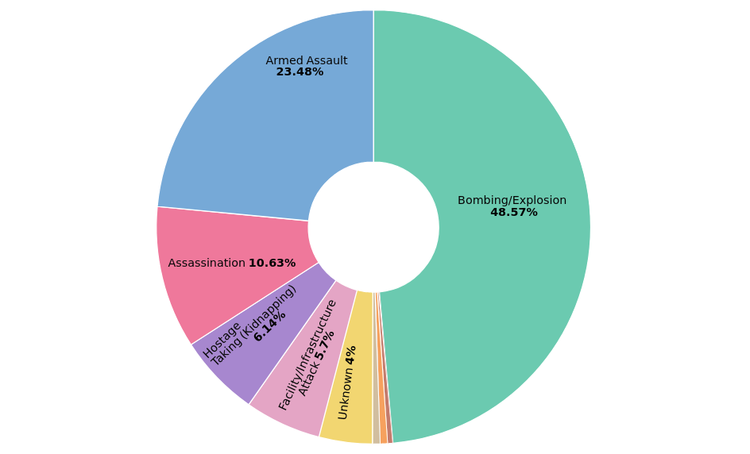
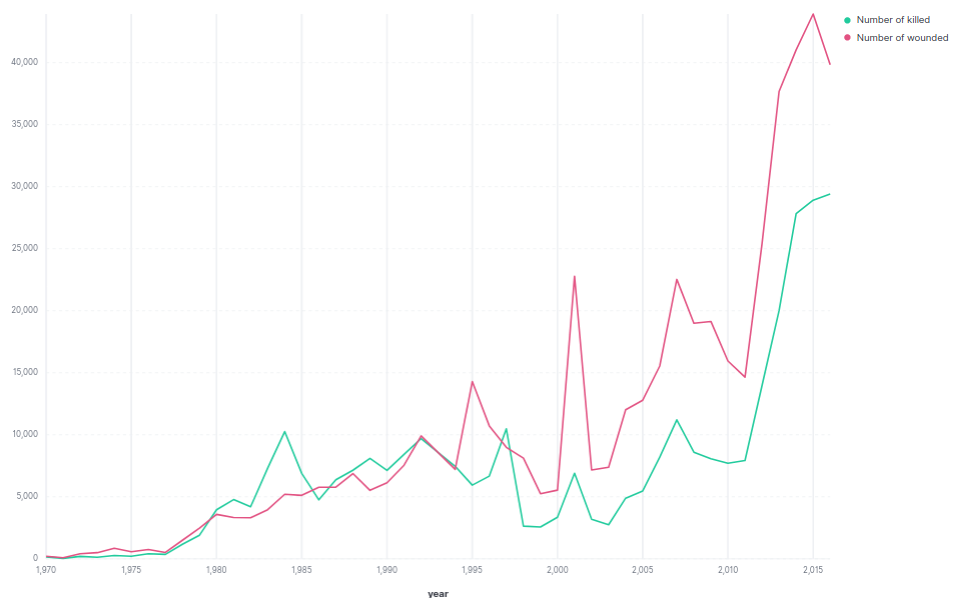
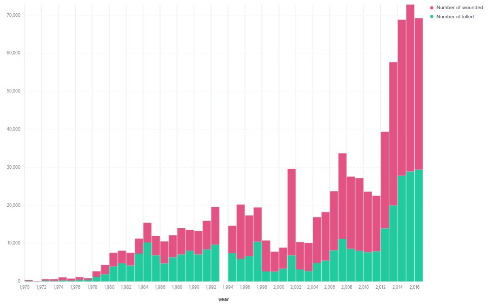
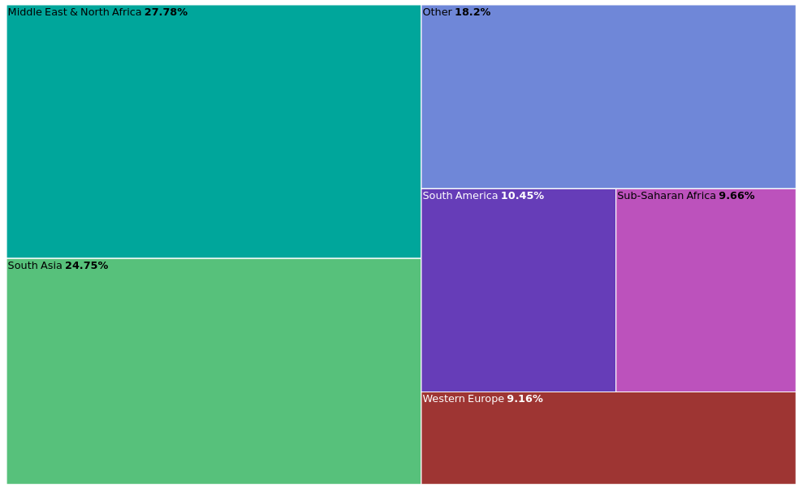
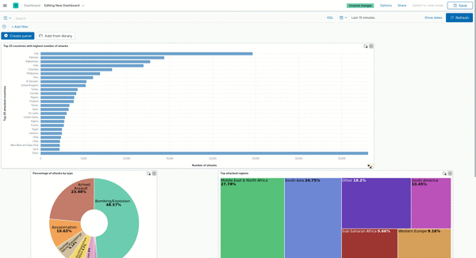

In this blog, we will try to dig in one of the controversial topics in the world: terrorism. All the process will be done on the ingest server (node-4) or you can do it on your local machine with 1 node cluster of Elasticsearch.

<h1 style="margin-top: 25px">Import data by Kibana plugin</h1>
To import the data, we first try to use the plugin from Kibana. However, by using this way, we can only push a small amount of log which up to 100MB. You can break your big data file into smaller chunks to import.

1. Go to home by clicking the top-left Kibana icon
    
2. Click on **Import a CSV, NDJSON, or log file** choose the ```csv file``` that you downloaded from [Kaggle Global Terrorism Dataset](https://www.kaggle.com/START-UMD/gtd)

3. Since you are trying to upload the whole file, you will see it is exceeded the limit (~ 163MB). Now, we need to find some ways else to import the data into Elasticsearch and Kibana.


<h1 style="margin-top: 25px">Import data by Python script</h1>

To do so, I write a script with python to import the data from the CSV file to our index in Elasticsearch. You can find the code from my Github repo ([here](https://github.com/tuminguyen/log_parser/blob/master/csv_parser.py)).

Basically, what I just do in there are:
- Read and extract each event
- Parse the data into my wanted format. The detail meaning of each column is described in [this codebook](https://start.umd.edu/gtd/downloads/Codebook.pdf). You can base on that to customize your filter, drop any columns and keep only your interested data.
- Index documents

Below is my customized format that you can consider:

```json
{
    "incident_id": "eventid",
    "incident_time":{
        "year": "iyear",
        "month": "imonth",
        "day": "iday"
    },
    "incident_loc":{
        "region": "region_txt",
        "country": "country_txt",
        "city": "city",
        "long": "longitude",
        "lat": "latitude"
    },
    "attack":{
        "type": "attacktype1_txt",
        "success": "success",
        "suicide": "suicide",
        "weapon": "weaptype1_txt",
    },
    "victim":{
        "type": "targtype1_txt",
        "subtype": "targsubtype1_txt",
        "is_hostkid": "ishostkid"
    },
    "perpetrator":{
        "nperp": "nperps",
        "nperpcap": "nperpcap",
        "group": "gname",
        "is_claimed": "claimed"
    },
    "consequences":{
        "total_kill": "nkill",
        "total_wound": "nwound",
        "perp_die": "nkillter",
        "perp_wound": "nwoundte",
        "is_property_lost": "property",
        "lost_value": "propvalue"
    }
}
```

You can store the _longitude_ and _latitude_ as a dict value and map the type as *geo_point*. 


```json
# Format
"incident_loc":{
    "region": "region_txt",
    "country": "country_txt",
    "city": "city",
    "geo": {
        "long": "longitude",
        "lat": "latitude"
    }
}


# Mapping field
mappings = {
    "properties": {
        "incident_loc": {
             "properties": {
                 "geo": {
                     "type": "geo_point"
                 }
             }
         }
    }
}
```


<h1 style="margin-top: 25px">Analyze and display dashboard on Kibana</h1>
Now, let's try to do some aggregations and show it on the Kibana dashboard. With ELK Stack version 7.12, you are fully supported to easily plot your data. 

_Some examples:_

<ins>*Top country with highest number of attacks*<ins>



<ins>*Percentage of attack types*<ins>



<ins>*Number of killed and wounded people (victim + perpetrator) in line graph*<ins>



<ins>*Number of killed and wounded people (victim + perpetrator) in stacked bar*<ins>



<ins>*Percentage of attacked regions*<ins>



Finally, you can save the visualization and push them to dashboard. It's your time to try now.



**RECOMMENDATION**
- For your practice, you should import just a small part of data, not all documents. In here I import ~120K  documents on my local machine so it will be much slower compared to doing that on the node of CSC. The best documents should be around 30K. 

- You can shuffle the data first then bulk with a random data or just choose the specific time range to scope the data

