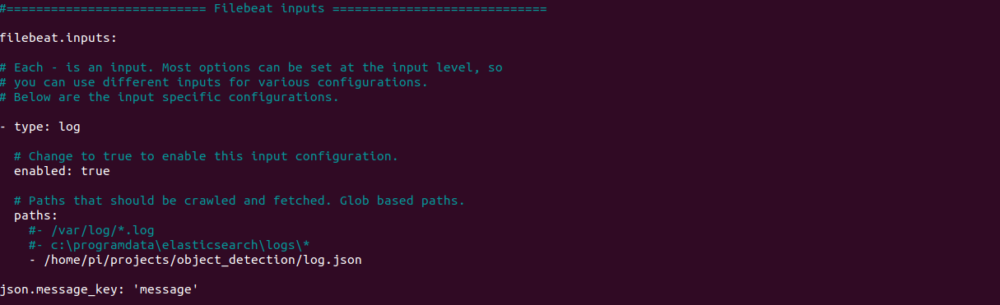
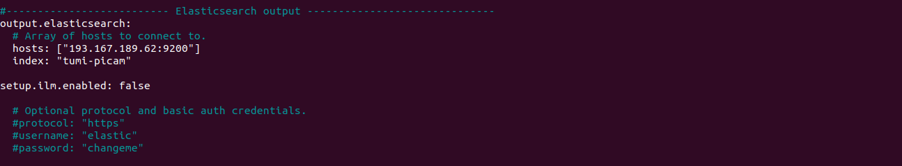
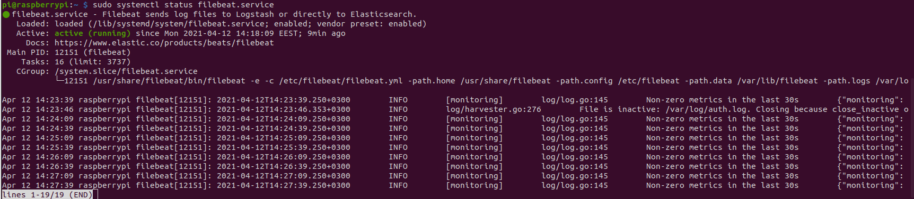
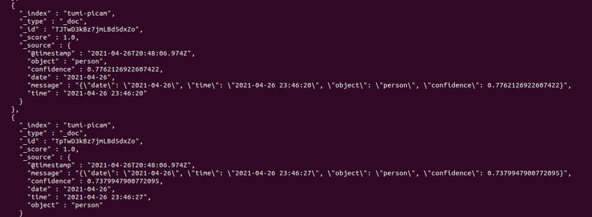
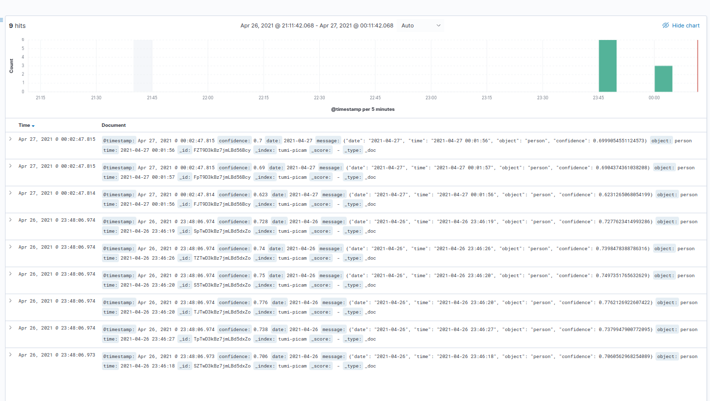
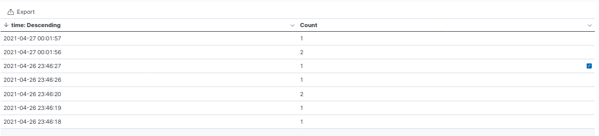

**_This short blog only takes you about 5 minutes or less to read but it may worth more than you think._**

In this week discussion, I will show you how I send log from my own IoT devices, hereby, a Raspberry Pi 4 running object detection tasks with a Picam. We will dump some detection info into a log file and make filebeat ship it to Elasticsearch to ingest. 

## Install filebeat on your IoT device 

As we may find that the Elaticsearch still has support for ARM version 64 bit so you can install it in the original way with ```sudo install```, the _"tragedy"_ here, on the other hand is the Pi runs on ARM 32bit and that's lead to one obstacle in this blog. However, I am just so happy to find out the <span style="color: rgb(204, 45, 71)">fantastic work</span> from Josh with [easyBEATS](https://github.com/josh-thurston/easyBEATS). With it, you can easily compile and install Beats (metric, file, packet, audit and heartbeat) on your local devices.

Now you should clone the [repo](https://github.com/josh-thurston/easyBEATS), follow the instruction on the Git and install the Beats. Once the installation completed you need to setup some configuration.

## Configure Filebeat

Open you terminal then go to the file ```/etc/filebeat/filebeat.yml```, using:

```
sudo nano /etc/filebeat/filebeat.yml
```
There are some places you need to specify and change the default. Do along the following:

```
# ============================== Filebeat inputs ===============================

# Enable the input config, change it to true
enabled: false ---> enable: true

# Change the location where Filebeat read. 
# Comment the old one
- /var/log/*.log ---> #- /var/log/*.log
# Add your new log path
- your_path_to_log_file

# Define the field to put log. So each record will be the value in 'message' key
json.message_key: 'message'
...
```

```
# ======================= Elasticsearch template setting =======================

# Setting up your index template name when filebeat shipping it to Elaticsearch

setup.template.name: "tumi"
setup.template.pattern: "tumi-*"

setup.template.settings:
  index.number_of_shards: 1
  #index.codec: best_compression
  #_source.enabled: false

...
```

```
# ---------------------------- Elasticsearch Output ----------------------------
output.elasticsearch:
  # Change localhost to your ingest server public IP
  hosts: ["localhost:9200"] ---> hosts: ["<your_ingest_node_IP>:9200"]
  # Add index name with the defined prefix
  index: "tumi-yourindexname"


setup.ilm.enable: false # optional, you dont really need this line
...
```

```
# ================================= Processors =================================
processors:
  # Filter fields to drop/exclude from your document
  - drop_fields:
      fields: ["agent", "log", "input", "host", "ecs", "related", "system", "event"]
  # Adding these lines to enable Filebeat to parse json in target string to JSON format (if capable). In here, apply for "message" field.
  - decode_json_fields:
      fields: ["message"]
      target: ""
  # Disable adding system metadata option if you dont want your doc contains so many abundant data
  - add_host_metadata:                            ---> #- add_host_metadata:
  - add_cloud_metadata: ~                         ---> #- add_cloud_metadata: ~
  - add_docker_metadata: ~                        ---> #- add_docker_metadata: ~
  - add_kubernetes_metadata: ~                    ---> #- add_kubernetes_metadata: ~
```

After all, it should be something like this.






Save and quit the file _(Ctrl x + y + Enter)_ then keep follow the instruction from [easyBeat repo](https://github.com/josh-thurston/easyBEATS) to start running the service. 


## Check 
Using this command to check the service status:

```
sudo systemctl status filebeat
```



Now, you see it works perfectly with the new config we just edited.

## Test sending log
In this section, we will parse the person detection log to ```log.json``` file then make filebeat read the data then ship to elasticsearch. The code for object detecion can be found [here](https://github.com/tuminguyen/object_detection_SSD_MobileNet_V3), tested on Ubuntu 20.04 and Pi 4 2GB RAM. 

To check the log has sucessfully pushed, you can try:

**Commandline approach:**
```
curl node-4:9200/tumi-picam/_search?pretty
```



**Interface approach:** click on the **Discover** on Kibana and choose your index to see the log has been pushed sucessfully.


You can now do some statistic from your picam data log.




<iframe src="https://livelyfreakonearth.ml/goto/3f3383c4d403b2ad8bc28574a6def8e5" height="910" width="1160"></iframe>

<span style="color: rgb(0, 153, 0); font-weight: bold">Super easy peasy! Enjoyyy !</span>


